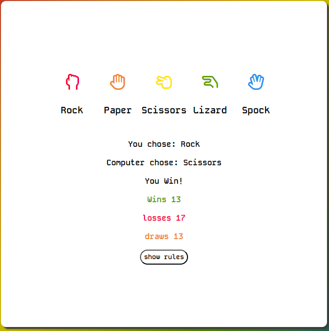

# Rock, Paper, Scissors, Lizard, Spock

This web application was developed for the integration and illustration of multiple features in JavaScript by putting into action an interactive functional game version for Rock, Paper, Scissors, Lizard, and Spock.
This project involves implementing event handling and dynamically updating the DOM within a responsive web application. It is a practical demonstration of how these JavaScript features can work together to create a smooth and enjoyable user experience.

## Features of the site.

### Feature #1.
 1. The way the game is laid out is different between the 3 main screen types (Mobile, Tablet, and desktop)

 - The desktop layout positions the buttons around the results and score box so everything is focused around the center of the play area.

 - The tablet layout is positioned so all buttons form a line on the top so all options are there for you to select and results are displayed just below.

 - The mobile layout is positioned in a way where all buttons are grouped so you can easily select the options and the results are displayed below

### Feature #2
 2. The colors I decided to use for this game were inspired by the colors from the show The Big Bang Theory and I kept the color scheme that I chose for the buttons for the background but darkened the colors so the background doesn't draw your attention away from the game.

### Feature #3
 3. The icon below the title of the page is set to alternate between all choices to display the use of repeated execution in Java Script.

#### Rock

#### Paper

#### Scissors

#### Lizard

#### Spock

### Feature #4
 4. I have included a rules section that has a button that will force a popup to appear with the rules displayed on it.

 - The button itself has a hover feature.

 - The rules themself have a small popup window that doesn't take over the whole screen and a close button on the top right for the ability to close down the popup.

### Feature #5
 5. When hovering or selecting a choice that you want to play the icon itself visibly changes so you know what you are about to select or have selected.

 - This is how the icon looks before hovering or selecting.

 - This is how the icon looks when hovering over and selecting on mobile.

### Feature #6
 6. After the player makes a choice. The response is instantly made and displayed in the results area as well as displaying their choice it also displays the computer choice as well as a message and the scores.

 - At the bottom of the results area displays the scoring system (Wins, Loses and draws)

### Features #7
 7. The favicon located at the top is a small image of rock paper scissors that I found on a site called [FlatIcon](https://www.flaticon.com/)

## Testing

When testing this game I performed all testing steps for all screen sizes.

 - I clicked one choice multiple times to ensure the results were true and displayed the correct message and the score increased properly and by the right amount.

 - I repeated this step with all other options to be clicked to ensure the results are consistent and there are no issues when selecting one option after another.

 - I opened and closed the rules multiple times to make sure they pop up in the same spot and that the open and close feature works consistently.

 - I refreshed the page multiple times to ensure the changing icon worked as intended.

## Goals

The goals for this site were to test my knowledge and ability to use Java Script effectively and use the functions I have learned to produce a game that includes most things I have learned, such as **Loops, Conditionals, Randomization, DOM Manipulation, Event Handling, Responsive UI interaction, Timing Events, Array management, and accessing and modifying the DOM**.

# Fixes

Bug Fixes:

 1. issue #1: There was an issue at the start of my Java Script code where all of a sudden after fixing a few spelling errors in my HTML the Java Script stopped working.
 - I fixed the issue by looking over my work and figured out that I misspelled the file name for script.js (I entered sript.js)

 2. issue #2: After creating the getResults function and testing the game afterward I realized that the results wouldn't update when you get a draw till you either get a win or loss then the score would update.
 - To fix the issue I read through all my code and realized I made a spelling error. I then fixed my error and the code worked smoothly.

# Deployment

I deployed the site using Github pages:

 1. Within the GitHub repository, select the settings tab,
 2. Under the "code and automation" tab, select "pages".
 3. Make sure you,
 - Set the source to "Deploy from branch",
 - Select "main branch"
 - Set folder to "Root"
 - Click "Save"

The site was deployed to GitHub pages. The steps to deploy are as follows:
In the GitHub repository, navigate to the Settings tab
From the source section drop-down menu, select the Main Branch
Once the main branch has been selected, the page will be automatically refreshed with a detailed ribbon display to indicate the successful deployment.

# Credits

## Content

+ I received the favicon from [FlatIcon](https://www.flaticon.com/)

+ I have received the fonts (Kode Mono, Chakra Petch) from [Google Fonts](https://fonts.google.com/)

+ I had ideas for some code for CSS and Java Script through [W3Scool](https://www.w3schools.com/)